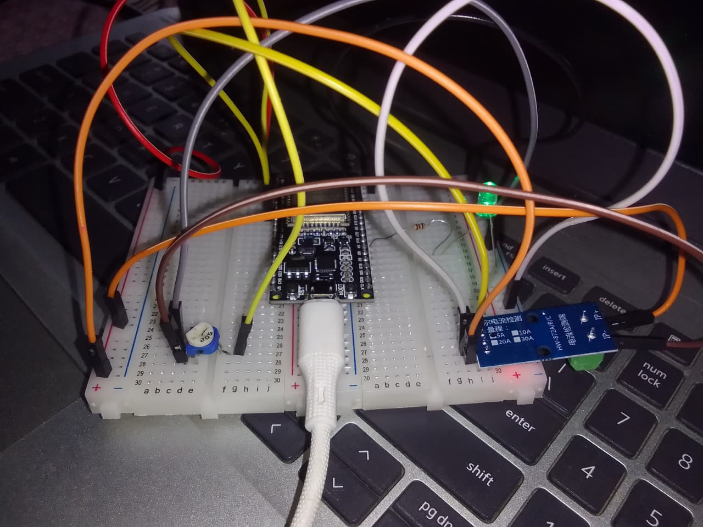
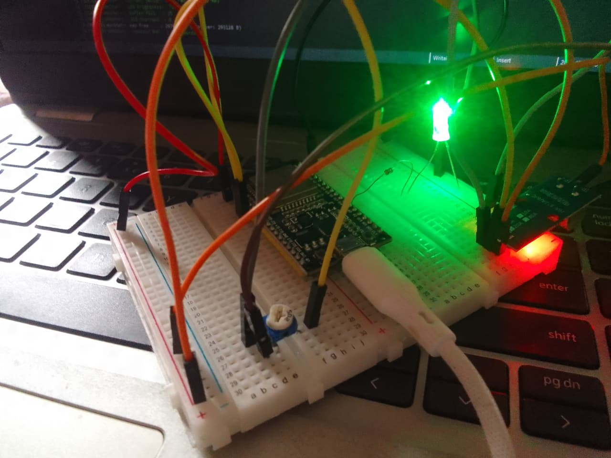

# ESP32 Analog Control System
### Lock-Free ISR Ring Buffer · Real-Time ADC Sampling · FreeRTOS

> A production-grade embedded system that samples a potentiometer and ACS712 current sensor at 1 kHz using a hardware timer ISR, transfers data to a FreeRTOS consumer task via a lock-free ring buffer, and drives a single LED via PWM — all on a bare ESP32 with no RTOS blocking in the ISR path.

---

## What Makes This Different From a Demo

Most FreeRTOS tutorials use `xQueueSendFromISR()` from the ISR. At 1 kHz that works. At 100 kHz it becomes your bottleneck — 100,000 spinlock acquisitions per second.

This project uses a **lock-free SPSC ring buffer** with C11 atomic memory ordering (`__ATOMIC_RELEASE` / `__ATOMIC_ACQUIRE`). The ISR never waits. The consumer task never spins. One writer, one reader, no lock needed — this is the pattern used in real motor controllers, audio codecs, and high-speed sensor interfaces.

---

## Hardware

| Component | Purpose |
|---|---|
| ESP32 DevKit (any 38-pin) | Main MCU |
| Potentiometer (any value) | Analog input — controls LED brightness |
| ACS712 current sensor module | Analog input — determines LED zone |
| Single LED (any color) | Output — brightness controlled by pot, blinks on danger zone |
| 220Ω resistor (×1) | Current limiting for LED |
| Breadboard + jumper wires | Connections |

---

## Pin Map

```
ESP32 GPIO34  ←  Potentiometer middle pin (wiper)
ESP32 3.3V    →  Potentiometer right pin
ESP32 GND     →  Potentiometer left pin

ESP32 GPIO35  ←  ACS712 OUT
ESP32 3.3V    →  ACS712 VCC  (3.3V keeps OUT within safe ADC range)
ESP32 GND     →  ACS712 GND
ACS712 IP+    ←  load current in
ACS712 IP-    →  load current out

ESP32 GPIO4   →  220Ω resistor → LED long pin (+)
ESP32 GND     →  LED short pin (-)
```

> **Note:** GPIO2 has an onboard LED on most ESP32 DevKit boards. You can test with zero external wiring by just flashing the code.

---

## LED Behavior

| Current Sensor Zone | % of ADC Scale | LED State | Meaning |
|---|---|---|---|
| LOW | 0 – 30% | ON — dim to bright (pot controls) | Safe — normal operation |
| MEDIUM | 31 – 60% | ON — dim to bright (pot controls) | Moderate load |
| HIGH | 61 – 85% | ON — dim to bright (pot controls) | High load — watch it |
| DANGER | > 85% | BLINKING — 500ms on/off | Overcurrent alert |

Potentiometer controls **brightness** across all zones — full left = off, full right = maximum brightness.

---
## Hardware Setup

### Full system wiring


### LED glowing — LOW zone (current sensor reading normal)

## Breadboard Wiring for LED

```
Breadboard column:   a          b    [GAP]    f         g
Row 1:          [GPIO4 wire]─[res leg1]    [res leg2]─[LED + long pin]
Row 2:          [GND wire]                            [LED - short pin]
```

Step by step:
1. GPIO4 jumper wire → Row 1, hole **a**
2. Resistor leg 1 → Row 1, hole **b**
3. Resistor leg 2 → Row 1, hole **f** ← bridges the center gap
4. LED long pin (+) → Row 1, hole **g**
5. LED short pin (−) → Row 2, hole **g**
6. GND jumper wire → Row 2, hole **a**

---

## System Architecture

```
                    ┌─────────────────────────────────────┐
                    │           ESP32 FreeRTOS             │
                    │                                      │
  GPIO34 (POT) ───►│  GPTimer ISR @ 1 kHz                │
  GPIO35 (SENS)───►│  adc_oneshot_read_isr()              │
                    │         │                            │
                    │         ▼                            │
                    │  ┌─────────────┐                    │
                    │  │ lock-free   │  rb_push()          │
                    │  │ ring buffer │  no mutex           │
                    │  │ 256 slots   │  no spinlock        │
                    │  └──────┬──────┘                    │
                    │         │  xSemaphoreGiveFromISR()  │
                    │         │  every 64 samples          │
                    │         ▼                            │
                    │  ┌─────────────┐  Priority 5        │
                    │  │ LED ctrl    │  Core 1             │
                    │  │ task        │  rb_pop() drain     │
                    │  │             │  LEDC PWM → GPIO4   │
                    │  └─────────────┘                    │
                    │                                      │
                    │  ┌─────────────┐  Priority 2        │
                    │  │ monitor     │  Core 1             │
                    │  │ task        │  every 3 seconds    │
                    │  │             │  UART health report │
                    │  └─────────────┘                    │
                    └─────────────────────────────────────┘
                                   │
                                GPIO4
                                   │
                              💡 LED (PWM)
```

---

## Project Structure

```
analog_control_system/
├── CMakeLists.txt              # top-level ESP-IDF project
└── main/
    ├── CMakeLists.txt          # component — lists all source files
    ├── main.c                  # app_main — init order matters
    ├── ringbuf.h               # lock-free SPSC ring buffer (header-only)
    ├── ringbuf.c               # stub for CMake
    ├── adc_sampler.h           # ISR public API
    ├── adc_sampler.c           # GPTimer + adc_oneshot_read_isr
    ├── led_controller.h        # LED task public API + pin defines
    ├── led_controller.c        # FreeRTOS task + LEDC PWM + zone logic
    ├── monitor_task.h          # monitor public API
    └── monitor_task.c          # health report every 3s over UART
```

---

## Key FreeRTOS Concepts Used

### Lock-Free Ring Buffer
Single producer (ISR) + single consumer (task) = no lock needed. `head` moves only in ISR, `tail` moves only in task. C11 `__ATOMIC_RELEASE` on writes, `__ATOMIC_ACQUIRE` on reads ensures correct memory ordering on dual-core Xtensa LX6.

```c
// ISR side — never blocks, never waits
static inline IRAM_ATTR bool rb_push(ring_buf_t *rb, const adc_sample_t *s) {
    uint32_t head = __atomic_load_n(&rb->head, __ATOMIC_RELAXED);
    uint32_t next = (head + 1) & RB_MASK;
    if (next == __atomic_load_n(&rb->tail, __ATOMIC_ACQUIRE)) return false;
    rb->buf[head] = *s;
    __atomic_store_n(&rb->head, next, __ATOMIC_RELEASE);
    return true;
}
```

### Why Not `xQueueSendFromISR()`?
`xQueueSendFromISR()` acquires a spinlock on every call. At 1 kHz that is manageable. At 100 kHz it consumes measurable CPU and introduces scheduler jitter. The lock-free buffer has zero overhead in the ISR path.

### Batched Semaphore Wake
The ISR gives the semaphore every 64 samples — not every sample. This reduces context-switch pressure by 16× while the consumer still processes data within 16 ms worst case.

### IRAM_ATTR
The ISR and `rb_push()` are placed in IRAM. If they lived in flash and a cache miss occurred during ISR execution, the CPU would stall and cause a panic. `IRAM_ATTR` pins them permanently in fast internal RAM.

### Task Priority Design
```
Priority 5 — led_controller_task  (core 1) — must respond fast
Priority 2 — monitor_task         (core 1) — low priority, just logging
ISR        — on_timer_alarm       (core 0) — hardware, highest
```
If led_controller crashes, monitor_task keeps running. Fault isolation.

---

## UART Health Report (every 3 seconds)

```
I (15000) monitor: ╔══════════════════════════════════════╗
I (15000) monitor: ║         SYSTEM HEALTH REPORT         ║
I (15000) monitor: ╠══════════════════════════════════════╣
I (15000) monitor:   Potentiometer : 2307 raw  (1.86 V)  brightness=56.3%
I (15000) monitor:   Current sensor:  374 raw  (  -72 mA)
I (15000) monitor:   Active zone   : LOW    → ON
I (15000) monitor:   Buffer fill   : 0%
I (15000) monitor:   ISR overruns  : 0
I (15000) monitor:   Heap free     : 297348 B  (min ever: 293120 B)
I (15000) monitor:   Monitor HWM   : 2160 words
I (15000) monitor: ╚══════════════════════════════════════╝
```

---

## Build & Flash

```bash
# 1. Set up ESP-IDF environment (once per terminal)
. $IDF_PATH/export.sh

# 2. Set flash size (4MB for most DevKit boards)
idf.py menuconfig
# Serial flasher config → Flash size → 4 MB

# 3. Build
idf.py build

# 4. Flash and monitor
idf.py -p COM3 flash monitor
# Replace COM3 with your port (COMx on Windows, /dev/ttyUSB0 on Linux)
```

---

## Common Issues

| Problem | Cause | Fix |
|---|---|---|
| `ringbuf.h: No such file or directory` | `INCLUDE_DIRS "."` missing in CMakeLists | Add `INCLUDE_DIRS "."` to `idf_component_register` |
| LED not responding | LEDC channel not updated | Call `ledc_update_duty()` after `ledc_set_duty()` |
| Current reads -3000 mA | ACS712 OUT voltage too high | Power ACS712 from 3.3V instead of 5V |
| ISR overruns reported | Consumer task too slow or buffer too small | Increase `RB_SIZE` or reduce ISR rate |
| Garbage characters in UART | Terminal doesn't support UTF-8 | Switch terminal encoding to UTF-8 |
| LED always off | No resistor or wrong breadboard row | Resistor must bridge center gap — one leg each side |

---

## Extending This Project

- **Full RGB LED** — change GPIO2 to GPIO25/26/27, add 3 LEDC channels, each zone gets true color (green/blue/yellow/red)
- **Real ADC at higher rate** — replace GPTimer with `adc_continuous` driver + DMA callbacks for true 100 kHz+ sampling
- **Multiple sensors** — add second ring buffer for second ISR source (MPSC requires separate buffers)
- **MQTT reporting** — add WiFi task at priority 1, publish health report JSON every 10 seconds

---

## Requirements

- ESP-IDF v5.0 or later
- ESP32 (dual-core, tested on ESP32-WROOM-32)
- Python 3.8+ (for idf.py)

---

## License

MIT License — use freely in personal and commercial projects.
